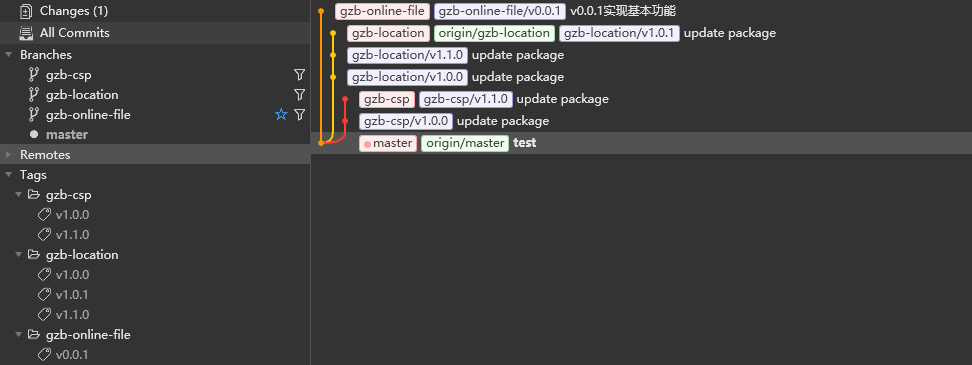
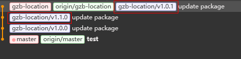
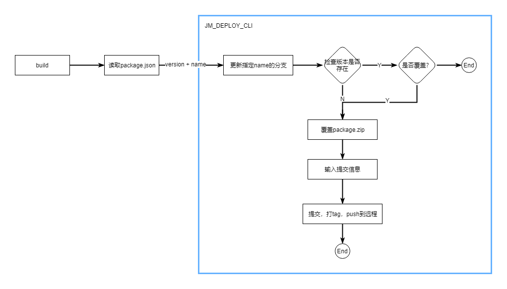
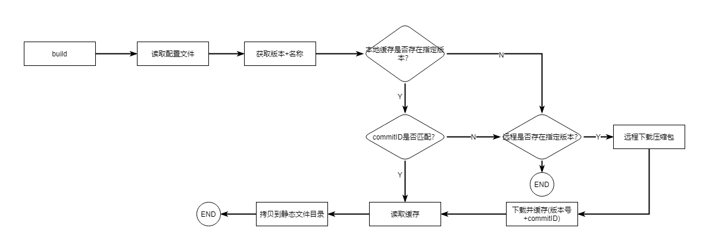

# 基于 Git 的前端静态资源集成方案

## 痛点

- 前后端资源打包依赖人工管理，低效率且容易错误
- 前端资源自动生成的，不应该放到版本库中进行管理。文件变化较大，版本切换时或者合并分支时可能存在冲突. 另外会产生没有意义的提交记录
- 前端后端的版本不存在关联性. 依赖人工进行管理

## 原则

- 自动化, 减少人工干预
- 前端资源作为后端的‘依赖’存在。就像 Spring 这些第三方库一样，前端资源也有版本号，但不会和后端强制绑定

<br/>

## 1. 基于 Git 的仓库设计

这里主要会用到 Git 的分支和 tag 的功能。分支主要用来区分应用，而 tag 用于设置版本。如下图
<br/>



> 版本库必须是 public

<br/>

### 1.1 分支

- 所有分支都是独立的，不存在关系，都从`master`衍生。整个分支模型呈辐射状
- 分支名为应用名称

这样做的好处是，我们需要更新一个应用时，只需拉取指定分支。

<br/>

### 1.2 Tag 与提交

- 按照`{应用名称}/{版本号}`的形式为每个提交的包打上 tag。例如 `gzb-location/1.1.1`
- 提交消息. **一个提交就是一个发布(release)**, 所以要求提交信息必须提供充分的信息，以便后端区分需要依赖哪个版本。这些信息包括新增或修复的功能、关联的后端版本、以及其他注意事项.

> **为什么加上前缀?**
>
> 因为 tag 是全局的，不能存在两个相同的名称的 tag。另外为了方便区分应用.

<br/>

> **如何获取指定的包?**
>
> 只需要 `应用名称 + 版本号` 就可以下载指定的包。例如在 gitlab 下，下载地址可以为 `http://code.ejiahe.com:82/gq-li/pkgs/raw/gzb-location/v1.0.0/package.zip`

<br/>

> **应用可能基于旧的版本打包，需要重新拉取分支吗?**
>
> 不需要。
>
> 1. 这是用于存储的仓库，**一个提交就是一个发布**，不需要和应用一样需要完整的历史记录. 我们只需要通过版本号来获取.
> 2. 分支会让模型变得更复杂
>
> 所以不管是基于旧版本衍生的版本，还是正常演进的版本, 都是在直接覆盖进行提交的。例如:
> 

<br/>

> **前端版本需要和后端版本强制绑定吗?**
>
> 我认为不需要。可能会存在某种大版本上的关联，但这不是强制绑定的。<br/>
> 因为前端和后端的代码变动不是同步的, 强制绑定可以给后端带来一丁点便利，却会让整个存储模型和前端的版本管理变得非常复杂。
> 前端资源应该作为后端的`第三方依赖`存在，后端根据版本号在构建时来获取前端资源。后面会介绍到<br/>

<br/>

### 1.3 目录

- 目录下只有一个`package.zip`文件。每次发布直接替换掉这个文件即可

这样做的好处是没有冲突。让可以我们的自动化发布脚本实现更加简单

<br/>

## 2. 前端发布流程

<br/>



<br/>

## 3. 后端集成流程

<br/>



后端项目不再需要将前端资源放到版本库中进行管理。而是跟第三方依赖一样，通过配置文件进行配置。例如

```json
{
  // 定义远程仓库地址
  "remoteOrigin": "http://code.ejiahe.com:82/gq-li/pkgs/",
  "pkgs": [
    {
      "name": "gzb-location",
      "version": "1.0.1"
    },
    {
      "name": "gzb-example",
      "version": "2.0.0",
      // 自定义输出路径。这里应该有个默认机制，比如都复制到/static/{name}目录下
      "out": "/static/example/"
    }
  ]
}
```

压缩包的下载不需要将 git 版本库克隆下来，可以直接通过`GitLab`提供的接口进行获取，比如:

```shell
http://code.ejiahe.com:82/gq-li/pkgs/raw/gzb-location/v1.0.0/package.zip
```

另外 GitLab 也提供了丰富的 API，可以根据这些 API 实现一些需求, 例如：

```
# 获取所有tag
GET /projects/:id/repository/tags
```

<br/>

> 扩展
>
> 目前使用的是绝对版本。需要开发者对这个依赖版本进行管理(这里是开发者唯一需要关心的地方)。
> 可以通过一些手段来减轻版本维护的工作量: <br/>
>
> 1. **合理的版本号定义**. 语义化的版本号定义，可以方便地确定一个约束范围.
> 假设前端静态资源遵循[`语义化版本(Semantic Version)`](https://semver.org/lang/zh-CN/), 即 <br/>
> **`主版本号.次版本号.修订号`**, 可以简单定义为 <br/>
> 主版本号: *做了不兼容的API修改*<br/>
> 次版本号: *做了向下兼容的功能性新增*<br/>
> 修订号: *做了向下兼容bug修复*<br/>
>
> 2. **版本依赖约束规则**: 例如参考 `npm` 的版本号实现:
>   - `2.0.0 - 3.1.4`: 匹配
>   - `^1.2.3`: 可以匹配 >=1.2.3 < 2.0.0的版本
>   - `~1.2.3`: 可以匹配 >=1.2.3 < 1.3.0的版本
>   - `1.x`: 匹配1.x所有版本
>   - `*`: 总是依赖最新版本
> 
> 使用类似于npm的版本机制，可以减少维护版本的成本。在每次build的时候自动更新版本约束范围内的前端资源.
>